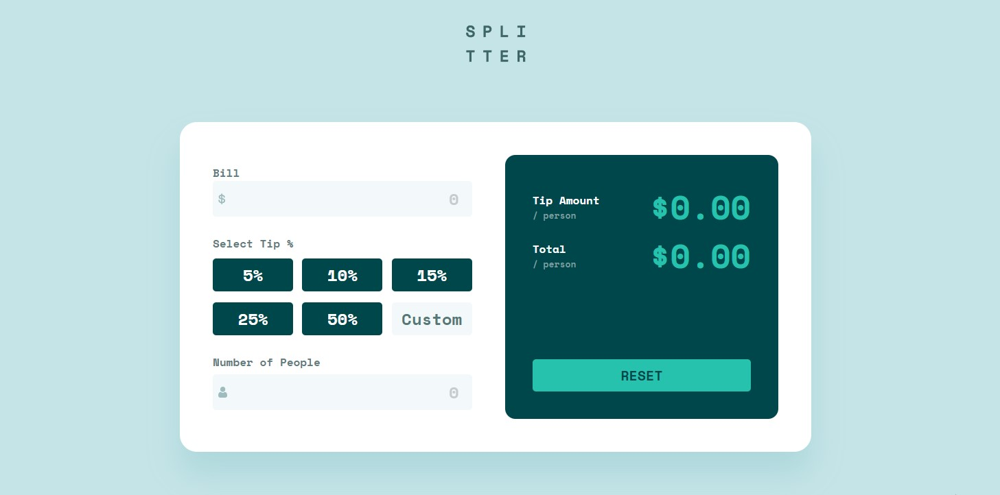

# Frontend Mentor - Tip calculator app solution

This is a solution to the [Tip calculator app challenge on Frontend Mentor](https://www.frontendmentor.io/challenges/tip-calculator-app-ugJNGbJUX). Frontend Mentor challenges help you improve your coding skills by building realistic projects.

## Table of contents

- [Overview](#overview)
  - [Screenshot](#screenshot)
  - [The challenge](#the-challenge)
  - [Links](#links)
  - [Built with](#built-with)
  - [What I learned](#what-i-learned)
- [Author](#author)

## Overview

A project that calculates the tip and the total bill per person. I am using Calculator as Parent Component where is State which is passed to children components.

### Screenshot

### The challenge

Users should be able to:

- View the optimal layout for the app depending on their device's screen size
- See hover states for all interactive elements on the page
- Calculate the correct tip and total cost of the bill per person

### Links

- Solution URL: [https://github.com/datomaluta/TipCalculator/tree/main/src]
- Live Site URL: [https://tipcalculate-datomaluta.netlify.app/]

## My process

### Built with

- Semantic HTML5 markup
- CSS custom properties
- Flexbox
- desktop-first workflow
- [React](https://reactjs.org/) - JS library
- [Scss] - For styles

### What I learned

More than learning, this challenge deepened the knowledge I already had in React. So, this project helped me to better understand the basic features of React that it has

## Author

[Davit Malutashvili]
